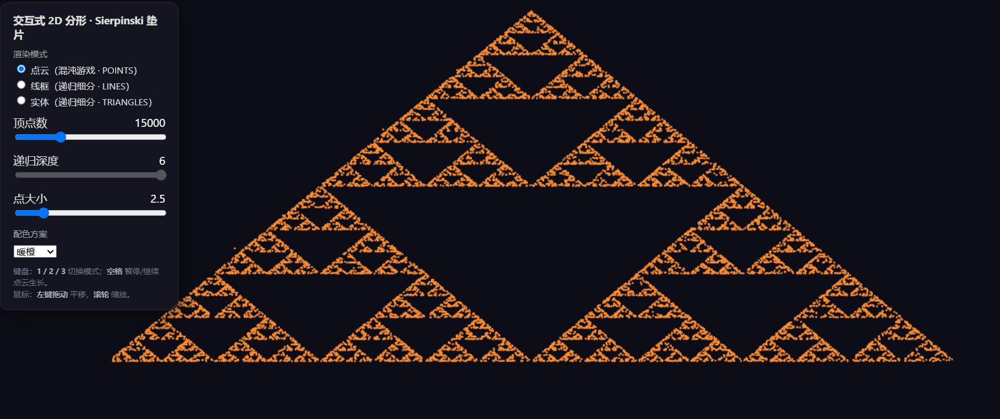
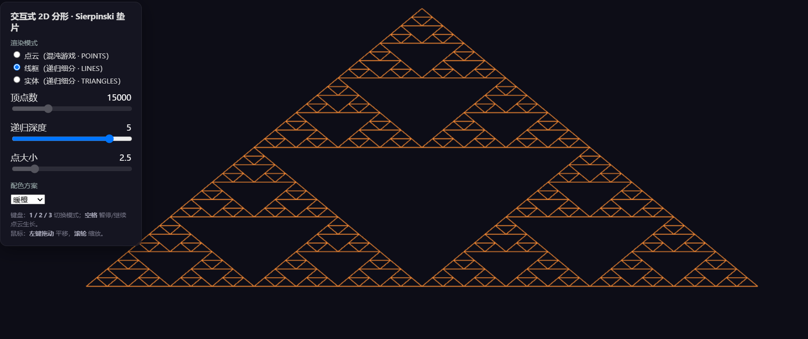
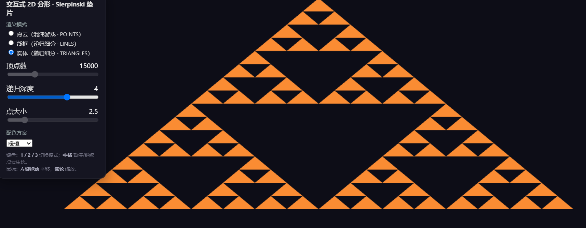

# AP1 · 交互式 2D 分形（Sierpinski 垫片）

基于原生 WebGL 2.0 + JavaScript，使用教材风格工具库（`Common/` 下的 `initShaders.js` / `MV.js` / `webgl-utils.js`）实现，无构建步骤，任意静态服务器即可运行。

## 运行方式

**在线体验（推荐）**

直接访问：[https://xiansheng34.github.io/cg-ap1/](https://xiansheng34.github.io/cg-ap1/)

**本地运行**

```bash
# 在项目根目录启动任意静态服务器，例如：
python -m http.server 8000
# 然后用浏览器打开 http://localhost:8000
```

> 浏览器需支持 WebGL 2.0。

## 实现要点

### 1. 最小图形程序结构

采用「应用程序 → 顶点数据 → 渲染」的流程：几何模块（`geometry.js`）生成 `Float32Array` 顶点数组，主程序（`main.js`）通过 `gl.bufferData` 上传到 VBO，再由顶点/片元着色器完成绘制。变换使用 `MV.js` 的 `mat4` 基本变换手工构造：

```
model = translate(offsetX, offsetY, 0) * scale(scale, scale, 1)
```

先对顶点做缩放，再叠加平移，作为 `uModel` 传入顶点着色器，统一作用于点云 / 线框 / 实体三种数据。

### 2. 两种生成算法

**混沌游戏（Chaos Game）**

以等边三角形三个顶点为吸引子，从任意初始点开始，反复执行：

```
p = (p + 随机顶点) / 2
```

把每一步得到的中点收集起来，达到足够多点数（默认 5000，最多 50000）后，这些点便收敛成 Sierpinski 垫片，以 `gl.POINTS` 渲染。该算法用一个 `Float32Array` 一次性预生成全部点，动画阶段只逐步增加 `drawArrays` 的 `count`，实现"逐点生长"。

**递归细分（Subdivision）**

```js
subdivide(triangle, depth)
```

从单个三角形出发，每递归一层把每个三角形拆成三个子三角形（连接三边中点），共得到 `3^depth` 个三角形。深度由用户输入（0–6）。同一组递归细分结果支持三种渲染模式：

- 点云（`gl.POINTS`）
- 线框（`gl.LINES`，三角形边经 Set 去重后上传）
- 实体（`gl.TRIANGLES`）

### 3. 交互

- **参数面板**（HTML 原生控件）：顶点数（点云）、递归深度（线框/实体）、点大小、3 套配色方案、渲染模式切换。
- **鼠标**：左键拖动平移、滚轮缩放（`mousedown` / `mousemove` / `wheel` 自行实现）。
- **键盘**：`1` / `2` / `3` 切换渲染模式，`空格` 暂停 / 继续逐点生长动画。

## 文件结构

```
Common/
  initShaders.js    着色器编译/链接
  MV.js             矩阵基本变换（mat4/mult/translate/scale/flatten）
  webgl-utils.js    上下文初始化
js/
  geometry.js       几何生成（混沌游戏 + 递归细分 + 边/顶点导出）
  interaction.js    鼠标 / 键盘交互
  ui.js             参数面板
  main.js           着色器 / VBO / 渲染循环 / 状态
index.html          页面与控件
README.md
```

## 在线演示

- 公网访问：[https://xiansheng34.github.io/cg-ap1/](https://xiansheng34.github.io/cg-ap1/)

## 截图

三种渲染模式各一张：

- 点云模式（混沌游戏）：
- 线框模式（递归细分）：
- 实体模式（递归细分）：
